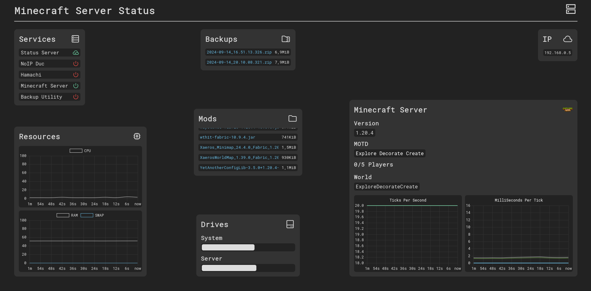

# MINECRAFT SERVER STATUS

An Open-source Minecraft Server Status Server

Backend made with:
- Node.js
- TypeScript
- Express
- BodyParser
- Https
- Socket.io

Frontend made with:
- JavaScript
- HTML
- CSS
- Socket.io
- Chart.js

## Installing the server

Run `make install`

## Generating the HTTPS certificates with certbot

Run `make generate-certificates`

## Starting the server

Run `make`

> In order to get the minecraft server service and tps detected it must be either a Forge server or a Fabric/Quilt server with [Fabric TPS](https://github.com/Pyrix25633/Fabric-FabricTPS/releases) mod installed

> Status Page Preview:
> 